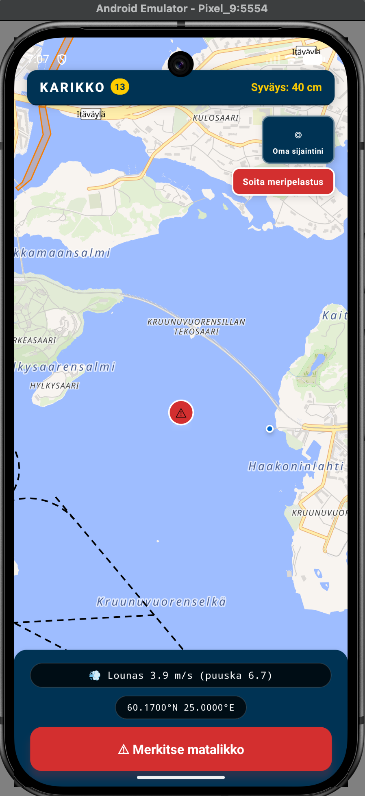

# Karikko

Matalikkovaroitin Suomen sisävesille ja rannikolle.



Saimaan vedenkorkeus on alimmillaan 50 vuoteen. Uusia kiviä paljastuu. Veneilijät eivät tiedä missä ne ovat. Karikko on sovellus jossa käyttäjät merkitsevät matalikkoja jaettavalle kartalle — ja näkevät reaaliaikaisesti vedenkorkeuden, viralliset väylät ja lähialueen alukset.

## Ominaisuudet

- **Jaettu matalikkokartta** — merkitse matalikko GPS-pisteeseen, kaikki näkevät sen heti
- **Valokuva merkinnästä** — liitä kuva matalikosta kameralla tai galleriasta, kuva pakkautuu automaattisesti
- **Vahvistukset** — muut veneilijät voivat vahvistaa merkinnän oikeaksi
- **Värikoodattu uhka-arvio** — punainen/oranssi/harmaa oman syväyksen mukaan
- **Vedenkorkeus suhteessa kausinormaaliin** — SYKE P10/P50/P90, 10 v historia per ISO-viikko
- **Viralliset väylät** — Väyläviraston navigointilinjat ja matalat alueet kartalla
- **AIS-alukset** — lähialueen alukset kartalla, napautus näyttää nimen ja tiedot
- **Tuulitiedote** — FMI:n ennuste, suunta ja nopeus alapalkissa
- **Salama-varoitus** — badge yläpalkissa jos maasalamaiskuja 50 km säteellä
- **Merenkulkutiedotteet** — Traficomin aktiiviset NtM-varoitukset
- **Meripelastus** — vahvistusdialogi → soittaa 112
- **A11y ensin** — ei punavihreää väriyhdistelmää, kaikki markerit accessibilityLabelilla, haptinen palaute painikkeissa

## Stack

**Sovellus**
- React Native + Expo SDK 54, TypeScript
- MapLibre React Native
- expo-sqlite (offline-varmuuskopio matalikkomerkinnöille)
- expo-location
- expo-image-picker + expo-image-manipulator (kuvaupload, automaattinen pakkaus 1000px/JPEG)

**Backend** → [karikko-api](https://github.com/mikko-lab/karikko-api) · [web-demo](https://karikko-api.vercel.app/demo)

## Kehitysympäristö

```bash
npm install
npx expo start

# Android-emulaattori (Pixel 9 AVD)
npx expo run:android
```

## Tietoturva

Käyttäjästä ei tallenneta henkilötietoja. Matalikkomerkinnöissä rate limit 10/tunti/IP.

## Lisenssi

MIT
